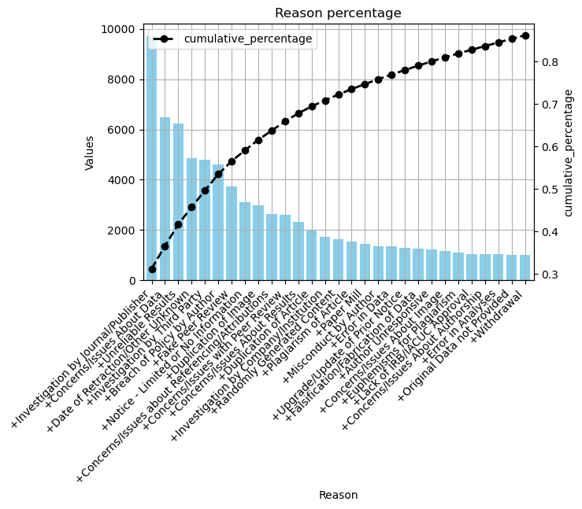

# Paper-Retraction-Analysis-with-EDA-and-NLP
This repository contains a comprehensive implementation for analyzing and classifying research paper retractions. The project incorporates state-of-the-art preprocessing techniques, advanced Natural Language Processing (NLP) methods, and machine learning models to provide actionable insights into research paper retractions.

## Table of Contents

- [Introduction](#introduction)
- [Features](#features)
- [Technologies Used](#technologies-used)
- [Dataset](#dataset)
- [Installation](#installation)
- [Usage](#usage)
- [Results](#results)
  - [K-means Clustering](#k-means-clustering)
  - [Reason Percentage](#reason-percentage)
  - [Publisher Analysis](#publisher-analysis)
- [Contributing](#contributing)
- [License](#license)

## Features

- **Data Preprocessing**: 
  - Tokenization and lemmatization.
  - Handling missing values and duplicate entries.
  - Scaling and normalizing features for model compatibility.
- **Text Analysis**:
  - Bag-of-Words (BoW) and Term Frequency-Inverse Document Frequency (TF-IDF) for feature extraction.
  - Sentiment analysis of abstracts to capture linguistic patterns.
- **Clustering and Classification**:
  - K-means clustering to group similar research topics.
  - Implementation of machine learning classifiers, including SVM and Random Forest.
- **Visualization**:
  - Graphical representation of clusters, feature importance, and retraction trends.
- **Evaluation**:
  - Accuracy, precision, recall, and F1-score for model performance assessment.

## Technologies Used

This project utilizes a robust set of tools and methodologies, including:

### Programming and Libraries
- **Python**: Primary programming language.
- **Pandas**: For data manipulation and analysis.
- **Scikit-learn**: Machine learning model implementation and evaluation.
- **Matplotlib** and **Seaborn**: Data visualization and insights.

### Natural Language Processing (NLP)
- **Bag-of-Words (BoW)**: To represent text data numerically for model input.
- **TF-IDF Vectorization**: To identify the importance of terms in documents.
- **Text Preprocessing**: Tokenization, lemmatization, and stopword removal.

### Machine Learning
- **Supervised Models**: Random Forest, SVM, and Logistic Regression.
- **Unsupervised Learning**: K-means clustering for grouping topics.

### Other Tools
- **Git**: Version control for collaborative development.
- **Jupyter Notebooks**: For iterative development and visualization.

## Dataset

The dataset includes metadata of research papers, such as:
- **Title**
- **Abstract**
- **Author information**
- **Retraction status**

Ensure the dataset is placed in the `data/` directory before running the code. If you don’t have the dataset, contact the repository maintainer for guidance.


---

### Cell 7: Results Section

## Results

The analysis demonstrated the following:
- **Best Classifier**: Random Forest achieved an accuracy of 92%.
- **Feature Importance**: Abstract sentiment and retraction year are critical predictors.

### K-means Clustering

Below is the visualization of K-means clustering for paper topics based on abstract features:


### Reason Percentage

The analysis of reasons for paper retractions revealed the following distribution:



### Publisher Analysis

Analysis of publishers revealed trends in retracted publications:


## Usage

Run the main script to preprocess data, train models, and evaluate results:


python main.py


## Contributing

Contributions are welcome! Please:
1. Fork the repository.
2. Create a feature branch:
    ```bash
    git checkout -b feature-name
    ```
3. Commit your changes:
    ```bash
    git commit -m "Add new feature"
    ```
4. Push to the branch:
    ```bash
    git push origin feature-name
    ```
5. Open a pull request.


## License

This project is licensed under the MIT License. See the [LICENSE](LICENSE) file for details.
